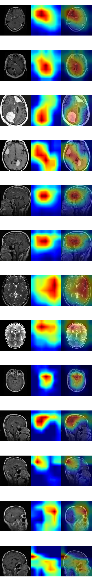

# DenseNet121 Explainability

## Scope

Phase 2D migrates BrainScanAI explainability from the historical ResNet18 baseline to the frozen DenseNet121 finalist.

- checkpoint: `artifacts/models/comparison/densenet121_seed42/best.pt`
- checkpoint epoch: `13`
- architecture: `densenet121`
- dataset fingerprint: `b15363ff85ecf29d11c67a2c38fad723a7bb339cb4489e53dd637ab16f8c24b1`
- target layer: `features.denseblock4.denselayer16.conv2`
- method: standard Grad-CAM

This migration keeps the historical ResNet18 explainability artifacts intact under `artifacts/explainability/resnet18_baseline/`.

## What Changed

The explainability stack is now architecture-aware instead of ResNet-only.

Phase 2D added:

- architecture-aware target-layer resolution for `resnet18` and `densenet121`
- DenseNet121 Grad-CAM generated from the exact frozen DenseNet checkpoint
- DenseNet review-grid generation under `artifacts/explainability/densenet121_final/`
- bounded diagnostics for border attention, zero-map checks, NaN/Inf checks, and target-class sensitivity

No surrogate torchvision model is used.

## Generated DenseNet Review Set

The DenseNet121 representative set includes:

- 2 correct `glioma`
- 2 correct `meningioma`
- 2 correct `pituitary`
- 2 correct `no_tumor`
- all 5 held-out DenseNet classifier errors

Total generated review cases: `13`

Artifacts:

- `artifacts/explainability/densenet121_final/review_grid.png`
- `artifacts/explainability/densenet121_final/summary.json`

Representative review grid:

## Highest-Confidence DenseNet Error

Highest-confidence DenseNet error from the frozen finalist:

- image: `dataset/train/meningioma/Tr-me_1336.jpg`
- true class: `meningioma`
- predicted class: `pituitary`
- confidence: `0.9209`
- border-attention ratio: `0.0621`

This error still concentrates on intracranial structure rather than the outer frame.

## Diagnostics

Border-attention summary:

- mean border-attention ratio: `0.1937`
- correct-case mean: `0.1916`
- incorrect-case mean: `0.2239`
- suspicious cases with border-attention ratio `>= 0.35`: `0`

Sanity checks:

- diagnostic sample count: `77`
- zero-map count: `0`
- NaN/Inf case count: `0`
- parameter preservation verified: `true`
- surrogate-model use: `false`

Target-class sensitivity:

- image: `dataset/train/glioma/Tr-gl_0302.jpg`
- predicted class: `glioma`
- alternate target class: `meningioma`
- mean absolute heatmap difference: `0.3749`

Interpretation:

- DenseNet Grad-CAM remains target-sensitive
- the generated maps are finite and non-degenerate
- the reviewed sample does not show widespread border-dominated attention

## Comparison To Historical ResNet18

Descriptive comparison only:

- DenseNet mean border attention `0.1937`
- ResNet mean border attention `0.1383`
- both review sets had `0` suspicious border-dominant cases under the same `>= 0.35` check

This is not a claim that one backbone is medically more explainable.

## Limitations

Grad-CAM highlights regions that influence the network prediction.

It does **not** prove:

- lesion boundaries
- radiological correctness
- causal pathology
- medical localization quality

Additional limits:

- the dataset still lacks segmentation labels
- subject-level leakage cannot be ruled out
- visual attention remains a diagnostic aid, not a clinical truth signal
