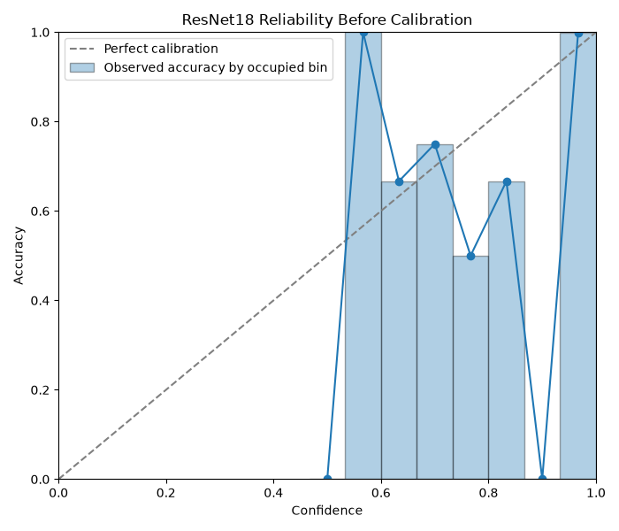
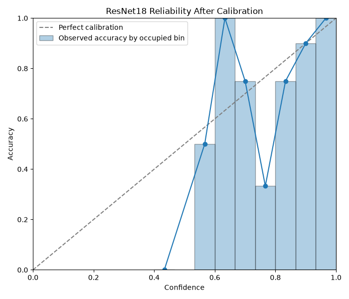

# ResNet18 Calibration

## Scope

Phase 2A adds statistically grounded confidence calibration and uncertainty analysis for the frozen BrainScanAI ResNet18 baseline.

- checkpoint: `artifacts/models/resnet18_baseline_best.pt`
- checkpoint epoch: `9`
- architecture: `resnet18`
- calibration method: scalar temperature scaling
- fitting split: `data/splits/val.csv` only
- test evaluation split: `data/splits/test.csv`
- learned temperature: `1.1344`

The classifier weights were not retrained or modified.

## Why Calibration Matters

Softmax confidence is not the same thing as real-world certainty.

If a model says `0.90` confidence, we would like predictions around that confidence level to be correct about `90%` of the time. Calibration aims to improve the reliability of the reported probabilities without changing the underlying class predictions.

Phase 2A focuses on:

- Expected Calibration Error (ECE)
- Negative Log Likelihood (NLL)
- multiclass Brier score
- predictive entropy
- normalized entropy
- top1-top2 probability margin
- error-detection behavior for incorrect predictions

Calibration does **not** improve classification accuracy by itself.

## Methodology

Phase 2A uses scalar temperature scaling:

```text
calibrated_logits = logits / T
```

where `T > 0` is learned by minimizing validation NLL.

Important rules followed in this phase:

- the ResNet18 checkpoint was frozen
- the calibration parameter was fit on `val.csv` only
- `test.csv` was not used during fitting
- the fitted temperature was frozen before any test-set calibration analysis
- the predicted class IDs were verified unchanged after scaling

## Validation Calibration Result

Validation sample count: `703`

Before calibration:

- accuracy: `0.9858`
- macro F1: `0.9858`
- ECE: `0.007234`
- NLL: `0.037927`
- Brier: `0.020002`

After temperature scaling:

- accuracy: `0.9858`
- macro F1: `0.9858`
- ECE: `0.010085`
- NLL: `0.037378`
- Brier: `0.019724`

Interpretation:

- temperature scaling improved NLL slightly
- temperature scaling improved Brier score slightly
- temperature scaling worsened ECE slightly
- class predictions and classification metrics stayed unchanged

## Held-Out Test Calibration Result

Test sample count: `702`

Before calibration:

- accuracy: `0.9815`
- macro F1: `0.9805`
- ECE: `0.009226`
- NLL: `0.039185`
- Brier: `0.024231`

After temperature scaling:

- accuracy: `0.9815`
- macro F1: `0.9805`
- ECE: `0.010585`
- NLL: `0.039530`
- Brier: `0.024192`

Interpretation:

- accuracy stayed unchanged
- macro F1 stayed unchanged
- Brier score improved slightly
- NLL worsened slightly on the test split
- ECE also worsened slightly on the test split

This means the validation-fit scalar temperature did **not** produce a better calibration baseline overall for this checkpoint.

## Reliability Diagrams

Committed artifacts:

- `artifacts/calibration/resnet18_baseline/reliability_before.png`
- `artifacts/calibration/resnet18_baseline/reliability_after.png`
- `artifacts/calibration/resnet18_baseline/reliability_before.json`
- `artifacts/calibration/resnet18_baseline/reliability_after.json`
- `artifacts/calibration/resnet18_baseline/reliability_before.csv`
- `artifacts/calibration/resnet18_baseline/reliability_after.csv`

Before calibration:



After calibration:



The occupied confidence bins remain concentrated near high confidence, and the validation-fit temperature mostly softens confidence slightly rather than dramatically reshaping the distribution.

## Uncertainty Diagnostics

Phase 2A exposes transparent uncertainty signals instead of a vague black-box score:

- calibrated top-1 confidence
- predictive entropy
- normalized entropy
- top1-top2 margin

Validation-derived uncertainty thresholds:

- entropy_q25: `0.000560`
- entropy_q75: `0.007972`
- margin_q25: `0.997511`
- margin_q75: `0.999872`

Rule:

- `HIGH` if normalized entropy `>= entropy_q75` or top1-top2 margin `<= margin_q25`
- `LOW` if normalized entropy `<= entropy_q25` and top1-top2 margin `>= margin_q75`
- otherwise `MEDIUM`

Test uncertainty counts:

- `LOW`: `172`
- `MEDIUM`: `346`
- `HIGH`: `184`

## Correct vs Incorrect Prediction Separation

Raw test confidence:

- mean confidence correct: `0.9899`
- mean confidence incorrect: `0.6799`

Calibrated test confidence:

- mean confidence correct: `0.9879`
- mean confidence incorrect: `0.6623`

Calibrated test entropy:

- mean entropy correct: `0.0347`
- mean entropy incorrect: `0.6559`

Calibrated test margin:

- mean margin correct: `0.9767`
- mean margin incorrect: `0.3642`

Error-detection AUROC:

- entropy: `0.9859`
- `1 - calibrated_confidence`: `0.9869`

Interpretation:

- incorrect predictions are much less confident on average
- incorrect predictions are much higher entropy on average
- incorrect predictions have much smaller top1-top2 margins
- uncertainty diagnostics are useful for ranking ambiguous or risky cases even though scalar calibration was not a better overall default

## High-Confidence Error Revisit

Phase 1E found:

- `3` incorrect predictions with raw confidence `>= 0.90`
- `1` incorrect prediction with raw confidence `>= 0.95`

After temperature scaling:

### Incorrect predictions `>= 0.90` raw confidence

- `dataset/train/glioma/Tr-gl_1181.jpg`
  - true: `glioma`
  - predicted: `meningioma`
  - raw confidence: `0.9563`
  - calibrated confidence: `0.9378`
  - entropy: `0.2384`
  - margin: `0.8765`

- `dataset/test/glioma/Te-gl_0232.jpg`
  - true: `glioma`
  - predicted: `meningioma`
  - raw confidence: `0.9359`
  - calibrated confidence: `0.9135`
  - entropy: `0.2994`
  - margin: `0.8279`

- `dataset/train/meningioma/Tr-me_1268.jpg`
  - true: `meningioma`
  - predicted: `pituitary`
  - raw confidence: `0.9209`
  - calibrated confidence: `0.8962`
  - entropy: `0.3417`
  - margin: `0.7939`

### Incorrect predictions `>= 0.95` raw confidence

- `dataset/train/glioma/Tr-gl_1181.jpg`
  - raw confidence: `0.9563`
  - calibrated confidence: `0.9378`

Interpretation:

- temperature scaling reduced overconfidence for the worst raw-confidence mistakes
- it did not change the predicted class
- it was useful as a confidence-softening mechanism on individual bad cases
- that local benefit was still not enough to make overall ECE better

## Default Recommendation

Phase 2A answer:

- scalar temperature scaling is implemented correctly
- it is validation-only and reusable
- it does **not** become the default BrainScanAI inference calibration yet

Reason:

- ECE worsened on validation and on the held-out test split
- NLL/Brier improvements were too small to justify replacing the raw baseline as the default output policy

Current practical recommendation:

- keep raw classifier probabilities as the default baseline probability output for now
- expose calibrated confidence, entropy, normalized entropy, and margin as analysis diagnostics
- revisit calibration methods in a later phase if we want to compare alternatives more systematically

## Artifacts

Committed artifacts for Phase 2A:

- `artifacts/calibration/resnet18_baseline/temperature.json`
- `artifacts/calibration/resnet18_baseline/metrics.json`
- `artifacts/calibration/resnet18_baseline/reliability_before.json`
- `artifacts/calibration/resnet18_baseline/reliability_after.json`
- `artifacts/calibration/resnet18_baseline/reliability_before.csv`
- `artifacts/calibration/resnet18_baseline/reliability_after.csv`
- `artifacts/calibration/resnet18_baseline/reliability_before.png`
- `artifacts/calibration/resnet18_baseline/reliability_after.png`

## Limitations

- scalar temperature scaling is only one simple calibration baseline
- the validation and test splits may still contain subject-level or near-duplicate leakage risk
- reliability diagrams are based on finite bin counts, so sparse-bin behavior should be interpreted cautiously
- uncertainty diagnostics can help flag ambiguity, but they do not provide clinical certainty
- this remains a research/educational prototype, not a medical device
