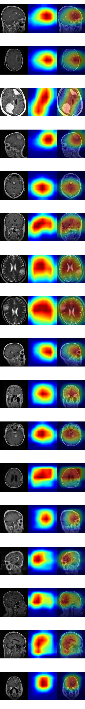

# ResNet18 Explainability

## Scope

Phase 1F adds scientifically correct Grad-CAM explainability for the frozen BrainScanAI ResNet18 baseline.

- checkpoint: `artifacts/models/resnet18_baseline_best.pt`
- checkpoint epoch: `9`
- architecture: `resnet18`
- class mapping: `glioma`, `meningioma`, `pituitary`, `no_tumor`
- dataset fingerprint: `b15363ff85ecf29d11c67a2c38fad723a7bb339cb4489e53dd637ab16f8c24b1`
- target layer: `layer4[-1].conv2`
- method: standard Grad-CAM

The new implementation lives in `src/brainscan/explainability/`.

The legacy `grad_cam.py` file remains preserved and untouched for the legacy snapshot. It is not the BrainScanAI 2.0 explainability path.

## Why The Legacy Grad-CAM Was Invalid

The legacy project generated prediction outputs from one model, but the Grad-CAM visualization path used an unrelated ImageNet `MobileNetV2` instance. That made the heatmap scientifically invalid for explaining the actual classifier decision.

Phase 1F fixes that by generating Grad-CAM from the exact frozen ResNet18 checkpoint used for inference. No surrogate torchvision model is created during explanation generation.

## Implementation Summary

Phase 1F adds:

- reusable Grad-CAM engine in `src/brainscan/explainability/gradcam.py`
- default target-layer resolver for ResNet18
- original-image loading for readable overlays
- explainability diagnostics:
  - heatmap min/max/mean
  - nonzero activation percentage
  - center of mass
  - border-attention ratio using the outer 10 percent of the image
- generation script: `scripts/generate_gradcam.py`
- unit tests for gradient capture, target-class behavior, parameter preservation, hook cleanup, overlay generation, and no-surrogate-model behavior

Important behavior:

- Grad-CAM runs with `model.eval()`
- gradients are enabled for backward computation
- no optimizer is used
- model weights are verified unchanged after explanation generation

## How To Generate Explanations

Generate the representative review set and diagnostics:

```powershell
.venv\Scripts\python.exe scripts\generate_gradcam.py
```

Generate a specific image explanation:

```powershell
.venv\Scripts\python.exe scripts\generate_gradcam.py --image dataset/test/glioma/Te-gl_0232.jpg
```

Generate an explanation against an explicit target class:

```powershell
.venv\Scripts\python.exe scripts\generate_gradcam.py --image dataset/test/glioma/Te-gl_0232.jpg --target-class meningioma
```

## Generated Outputs

The script writes outputs under `artifacts/explainability/resnet18_baseline/`.

Committed small review artifacts:

- `artifacts/explainability/resnet18_baseline/review_grid.png`
- `artifacts/explainability/resnet18_baseline/summary.json`

Ignored generated folders:

- `original/`
- `heatmap/`
- `overlay/`
- `metadata/`

Representative review grid:



## Representative Correct Cases

The representative set includes:

- 2 correct `glioma`
- 2 correct `meningioma`
- 2 correct `pituitary`
- 2 correct `no_tumor`

Across these correct examples, the model usually concentrates on intracranial regions instead of flat image corners or obvious frame/background artifacts.

Observed patterns from the review grid:

- several tumor-positive cases focus on a localized or lopsided brain region that overlaps the visible abnormal mass area
- the two `no_tumor` examples still show broad intracranial attention rather than a tiny lesion-like focus
- some correct cases remain somewhat diffuse even when the prediction is very confident

These are attention maps, not lesion segmentations.

## Representative Incorrect Cases

The representative error set includes:

- `dataset/train/glioma/Tr-gl_1181.jpg` predicted `meningioma` with confidence `0.9563`
- `dataset/test/glioma/Te-gl_0232.jpg` predicted `meningioma` with confidence `0.9359`
- `dataset/train/meningioma/Tr-me_1268.jpg` predicted `pituitary` with confidence `0.9209`
- `dataset/test/meningioma/Te-me_0178.jpg` predicted `glioma` with confidence `0.8381`
- `dataset/test/meningioma/Te-me_0226.jpg` predicted `glioma` with confidence `0.7972`

Observed error behavior:

- the high-confidence `glioma -> meningioma` mistakes still focus on intracranial regions near the visible abnormal structure instead of image borders
- the `meningioma -> pituitary` high-confidence mistake is also centered inside the brain with low border attention, suggesting class confusion rather than obvious shortcut learning
- the `meningioma -> glioma` errors remain intracranial but are broader and somewhat more diffuse than the strongest correct localizations

## High-Confidence Error Notes

### `dataset/train/glioma/Tr-gl_1181.jpg`

- true class: `glioma`
- predicted class: `meningioma`
- confidence: `0.9563`
- border-attention ratio: `0.0905`
- broad interpretation: concentrated intracranial focus toward the upper-right lesion-side region in the sagittal view

### `dataset/test/glioma/Te-gl_0232.jpg`

- true class: `glioma`
- predicted class: `meningioma`
- confidence: `0.9359`
- border-attention ratio: `0.0666`
- broad interpretation: compact intracranial focus near the visible right-side lesion region

### `dataset/train/meningioma/Tr-me_1268.jpg`

- true class: `meningioma`
- predicted class: `pituitary`
- confidence: `0.9209`
- border-attention ratio: `0.0880`
- broad interpretation: intracranial focus near the central-to-superior abnormal region, not the image frame

These failures are still mistakes, but they do not look like simple border or empty-background shortcuts.

## Explainability Diagnostics

Aggregate diagnostic sample size: `80`

Border-attention summary from `summary.json`:

- mean border-attention ratio: `0.1383`
- mean border-attention ratio for correct cases: `0.1398`
- mean border-attention ratio for incorrect cases: `0.1307`
- suspicious cases with border-attention ratio `>= 0.35`: `0`

Interpretation:

- the reviewed sample does not show strong evidence of widespread border-dominated attention
- correct and incorrect examples have similar low border-attention levels
- this does not prove the model is free from shortcut learning, but it reduces one obvious concern

## Sanity Checks

Phase 1F verified:

- explanations are generated from the passed prediction model instance
- heatmaps are finite and normalized to `0..1`
- target-class default uses the predicted class
- invalid target-class IDs are rejected
- model parameters remain unchanged after Grad-CAM generation
- hooks are removed cleanly
- overlays preserve recognizable MRI appearance

Target-class sensitivity check:

- image: `dataset/train/glioma/Tr-gl_0989.jpg`
- predicted class: `glioma`
- alternate target class: `meningioma`
- mean absolute heatmap difference: `0.4734`

This confirms the explanations are not trivially identical across different class targets.

## Limitations

Grad-CAM highlights regions influencing the model prediction.

It does **not** prove:

- tumor boundaries
- tumor location with pixel precision
- causal pathology
- clinical validity

Additional limitations:

- there are no segmentation labels in this repository, so no medical localization score is available
- the dataset may still contain subject-level or near-duplicate leakage
- visual interpretation of MRI attention maps remains uncertain without clinical annotation
- some correct and incorrect cases are still fairly diffuse

Grad-CAM++ is intentionally not implemented in Phase 1F because standard Grad-CAM was the required clean baseline.
